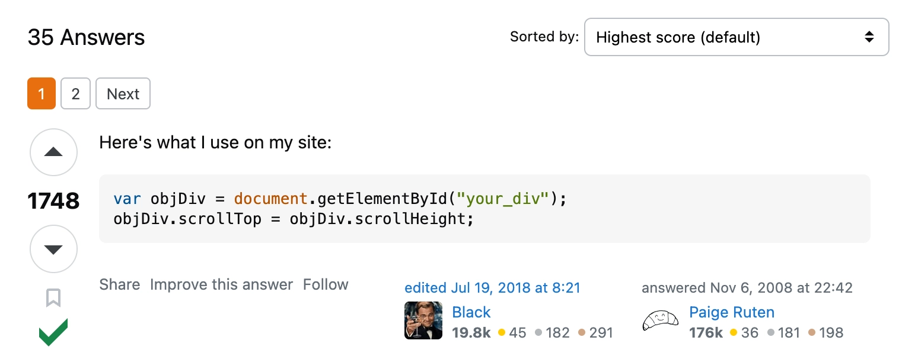

# Single page applications, routing

Single Page Applications (SPAs) are web applications that load a single HTML page and dynamically update that page as the user interacts with the app. This approach allows for a smoother user experience compared to traditional multi-page applications (MPAs), where each interaction often requires a full page reload.

Library to use for routing - https://reactrouter.com/en/main

- Install react-router-dom

```jsx
npm i react-router-dom
```

- Update App.jsx with the respective routes

```jsx
import ReactDOM from "react-dom/client";
import { BrowserRouter, Routes, Route } from "react-router-dom";
import Layout from "./pages/Layout";
import Home from "./pages/Home";
import Blogs from "./pages/Blogs";
import Contact from "./pages/Contact";
import NoPage from "./pages/NoPage";

export default function App() {
  return (
    <BrowserRouter>
	    <Routes>
        <Route index element={<Home />} />
        <Route path="blogs" element={<Blogs />} />
        <Route path="contact" element={<Contact />} />
        <Route path="*" element={<NoPage />} />
      </Routes>
    </BrowserRouter>
  );
}

const root = ReactDOM.createRoot(document.getElementById('root'));
root.render(<App />);
```

Code from class

```jsx

import './App.css'
import { BrowserRouter, Routes, Route, Link } from "react-router-dom";

function App() {

  return <div>
    <BrowserRouter>
      <Link to="/">Allen</Link>
      | 
      <Link to="/neet/online-coaching-class-11">Class 11</Link> 
      | 
      <Link to="/neet/online-coaching-class-12">Class 12</Link>
      <Routes>
        <Route path="/neet/online-coaching-class-11" element={<Class11Program />} />
        <Route path="/neet/online-coaching-class-12" element={<Class12Program />} />
        <Route path="/" element={<Landing />} />
      </Routes>
    </BrowserRouter>
  </div>
}

function Landing() {
  return <div>
    Welcome to allen
  </div>
}

function Class11Program() {
  return <div>
      NEET programs for Class 11th
  </div>
}

function Class12Program() {
  return <div>
      NEET programs for Class 12th
  </div>
}

export default App

```
---

# Layouts

Layouts let you `wrap` every route inside a certain component (think headers and footers)

```jsx
import ReactDOM from "react-dom/client";
import { BrowserRouter, Routes, Route } from "react-router-dom";
import Layout from "./pages/Layout";
import Home from "./pages/Home";
import Blogs from "./pages/Blogs";
import Contact from "./pages/Contact";
import NoPage from "./pages/NoPage";

export default function App() {
  return (
    <BrowserRouter>
      <Routes>
        <Route path="/" element={<Layout />}>
          <Route index element={<Home />} />
          <Route path="blogs" element={<Blogs />} />
          <Route path="contact" element={<Contact />} />
          <Route path="*" element={<NoPage />} />
        </Route>
      </Routes>
    </BrowserRouter>
  );
}

const root = ReactDOM.createRoot(document.getElementById('root'));
root.render(<App />);
```
---

# useRef

### What is `useRef`?

In React, `useRef` is a hook that provides a way to create a **reference** to a value or a DOM element that persists across renders but **does not trigger a re-render** when the value changes.

### Key Characteristics of `useRef`:

1. **Persistent Across Renders**: The value stored in `useRef` persists between component re-renders. This means the value of a `ref` does not get reset when the component re-renders, unlike regular variables.
2. **No Re-Renders on Change**: Changing the value of a `ref` (`ref.current`) does **not** cause a component to re-render. This is different from state (`useState`), which triggers a re-render when updated.

### 1. Focussing on an input box

```jsx
import React, { useRef } from 'react';

function FocusInput() {
  // Step 1: Create a ref to store the input element
  const inputRef = useRef(null);

  // Step 2: Define the function to focus the input
  const handleFocus = () => {
    // Access the DOM node and call the focus method
    inputRef.current.focus();
  };

  return (
    <div>
      {/* Step 3: Attach the ref to the input element */}
      <input ref={inputRef} type="text" placeholder="Click the button to focus me" />
      <button onClick={handleFocus}>Focus the input</button>
    </div>
  );
}

export default FocusInput;
```

### 2. Scroll to bottom

```jsx
import React, { useEffect, useRef, useState } from 'react';

function Chat() {
  const [messages, setMessages] = useState(["Hello!", "How are you?"]);
  const chatBoxRef = useRef(null);

  // Function to simulate adding new messages
  const addMessage = () => {
    setMessages((prevMessages) => [...prevMessages, "New message!"]);
  };

  // Scroll to the bottom whenever a new message is added
  useEffect(() => {
    chatBoxRef.current.scrollTop = chatBoxRef.current.scrollHeight;
  }, [messages]);

  return (
    <div>
      <div 
        ref={chatBoxRef} 
        style={{ height: "200px", overflowY: "scroll", border: "1px solid black" }}
      >
        {messages.map((msg, index) => (
          <div key={index}>{msg}</div>
        ))}
      </div>
      <button onClick={addMessage}>Add Message</button>
    </div>
  );
}

export default Chat;

```

https://stackoverflow.com/questions/270612/scroll-to-bottom-of-div



### 3. Clock with start and stop functionality

Notice the re-renders in both of the following cases - 

```jsx
// ugly code
import React, { useState } from 'react';

function Stopwatch() {
  const [time, setTime] = useState(0);
  const [intervalId, setIntervalId] = useState(null); // Use state to store the interval ID

  const startTimer = () => {
    if (intervalId !== null) return; // Already running, do nothing

    const newIntervalId = setInterval(() => {
      setTime((prevTime) => prevTime + 1);
    }, 1000);
    
    // Store the interval ID in state (triggers re-render)
    setIntervalId(newIntervalId);
  };

  const stopTimer = () => {
    clearInterval(intervalId);

    // Clear the interval ID in state (triggers re-render)
    setIntervalId(null);
  };

  return (
    <div>
      <h1>Timer: {time}</h1>
      <button onClick={startTimer}>Start</button>
      <button onClick={stopTimer}>Stop</button>
    </div>
  );
}

export default Stopwatch;

```

```jsx
// better code
import React, { useState, useRef } from 'react';

function Stopwatch() {
  const [time, setTime] = useState(0);
  const intervalRef = useRef(null);

  const startTimer = () => {
    if (intervalRef.current !== null) return; // Already running, do nothing

    intervalRef.current = setInterval(() => {
      setTime((prevTime) => prevTime + 1);
    }, 1000);
  };

  const stopTimer = () => {
    clearInterval(intervalRef.current);
    intervalRef.current = null;
  };

  return (
    <div>
      <h1>Timer: {time}</h1>
      <button onClick={startTimer}>Start</button>
      <button onClick={stopTimer}>Stop</button>
    </div>
  );
}
```
---
# Rolling up the state, unoptimal re-renders

As your application grows, you might find that multiple components need access to the same state. Instead of duplicating state in each component, you can lift the state up to the LCA, allowing the common ancestor to manage it.
