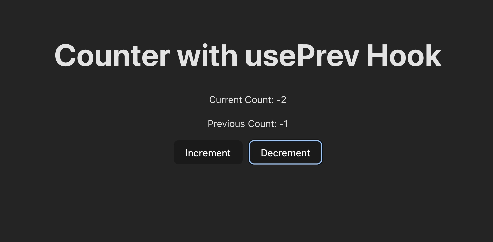

# Custom hooks

Custom hooks in React are a powerful feature that allows you to encapsulate and reuse stateful logic across different components. They are essentially JavaScript functions that can use React hooks internally. By creating custom hooks, you can abstract away complex logic, making your components cleaner and more manageable.

### Why Use Custom Hooks?

1. **Reusability**: If you find yourself using the same logic in multiple components, a custom hook can help you avoid code duplication.
2. **Separation of Concerns**: They allow you to separate business logic from UI logic, making your components more focused and easier to understand.

## Common custom hooks

- useFetch (https://swr.vercel.app/)
    
```jsx
import { useState, useEffect } from 'react';

export const useFetch = (url: string) => {
  const [data, setData] = useState(null);
  const [loading, setLoading] = useState(true);
  const [error, setError] = useState<Error | null>(null);

  useEffect(() => {
    const fetchData = async () => {
      setLoading(true);
      try {
        const response = await fetch(url);
        const result = await response.json();
        setData(result);
      } catch (err) {
        setError(err as Error);
      } finally {
        setLoading(false);
      }
    };

    fetchData();
  }, [url]);

  return { data, loading, error };
};
```

- usePrevValue
    
    ```jsx
    
    ```
        
- useFetch with re-fetching
    
```jsx
import { useState, useEffect } from 'react';

export const useFetch = (url: string, interval: number | null = null) => {
  const [data, setData] = useState<any>(null);
  const [loading, setLoading] = useState<boolean>(true);
  const [error, setError] = useState<Error | null>(null);

  const fetchData = async () => {
    setLoading(true);
    try {
      const response = await fetch(url);
      const result = await response.json();
      setData(result);
    } catch (err) {
      setError(err as Error);
    } finally {
      setLoading(false);
    }
  };

  useEffect(() => {
    fetchData(); // Initial fetch

    if (interval !== null) {
      const fetchInterval = setInterval(() => {
        fetchData();
      }, interval);

      return () => clearInterval(fetchInterval); // Clear interval on cleanup
    }
  }, [url, interval]);

  return { data, loading, error };
};

```
    
- usePrev
    
```jsx
import { useRef, useState, useEffect } from 'react'
import './App.css'

export const usePrev = (value) => 
  const ref = useRef();

  // Update the ref with the current value after each render
  useEffect() => 
    ref.current = value;
  , [value];

  // Return the previous value (current value of ref before it is updated)
  return ref.current;
;

function App() 
  const [count, setCount] = useState(0);
  const prevCount = usePrev(count); // Track the previous count value

  return (
    <div style={{ textAlign: 'center', marginTop: '50px' }}>
      <h1>Counter with usePrev Hook</h1>
      <p>Current Count: {count}</p>
      <p>Previous Count: {prevCount}</p>
      <button onClick={() => setCount(count + 1)}>Increment</button>
      <button onClick={() => setCount(count - 1)} style={{ marginLeft: '10px' }}>Decrement</button>
    </div>
  );


export default App

```

    
- useIsOnline
    
```jsx
import { useEffect, useState } from 'react';

const useIsOnline = () => {
  const [isOnline, setIsOnline] = useState(navigator.onLine);

  useEffect(() => {
    const updateOnlineStatus = () => setIsOnline(navigator.onLine);

    window.addEventListener('online', updateOnlineStatus);
    window.addEventListener('offline', updateOnlineStatus);

    // Clean up the event listeners on component unmount
    return () => {
      window.removeEventListener('online', updateOnlineStatus);
      window.removeEventListener('offline', updateOnlineStatus);
    };
  }, []);

  return isOnline;
};

export default useIsOnline;

```

- useDebounce (https://gist.github.com/hkirat/439a0be477e3c31b08c1f7e0f4582674)
- Debouncing is an optimization technique used to delay the execution of a function until a specified period of inactivity has passed. In React, it prevents expensive operations—like server-side API requests, heavy calculations, or component re-renders—from firing on every single keystroke or rapid user interaction
    
 ```jsx
 import { useState, useEffect } from 'react';
 
 const useDebounce = (value, delay) => {
     const [debouncedValue, setDebouncedValue] = useState(value);
 
     useEffect(() => {
         const handler = setTimeout(() => {
             setDebouncedValue(value);
         }, delay);
 
         return () => {
             clearTimeout(handler);
         };
     }, [value, delay]);
 
     return debouncedValue;
 };
 
 export default useDebounce;
 
 ```
    
- If we want to debounce function (from ak)
        
 ```jsx
 const debounce = (func, delay) => {
   let timeout;
   return (...args) => {
     clearTimeout(timeout);  // Clears the previous timer
     timeout = setTimeout(() => func(...args), delay);  // Starts a new timer
   };
 };
 ```
        

## Assignment

Read about swr and react-query

- Is `usePrev` hook that we have made indeed correct? Try out this example https://giacomocerquone.com/blog/life-death-useprevious-hook/
    
```jsx
import { useRef, useState, useEffect } from 'react'
import './App.css'

export const usePrev = (value) => {
  const ref = useRef();

  // Update the ref with the current value after each render
  useEffect(() => {
    ref.current = value;
  }, [value]);

  // Return the previous value (current value of ref before it is updated)
  return ref.current;
};

function App() {
  const [count, setCount] = useState(0);
  const prevCount = usePrev(count); // Track the previous count value
  const [x, setX] = useState(0);

  useEffect(() => {
    setInterval(() => {
      setX(x => x + 1);
    }, 1000)

  }, []);
  return (
    <div style={{ textAlign: 'center', marginTop: '50px' }}>
      <h1>Counter with usePrev Hook</h1>
      <p>Current Count: {count}</p>
      <p>Previous Count: {prevCount}</p>
      {x}
      <button onClick={() => setCount(count + 1)}>Increment</button>
      <button onClick={() => setCount(count - 1)} style={{ marginLeft: '10px' }}>Decrement</button>
    </div>
  );
}

export default App

```

Explore https://usehooks.com/


---
# Introduction to Recoil
A state management library for React that provides a way to manage global state with fine-grained control.

Recoil minimizes unnecessary renders by only re-rendering components that depend on changed atoms

The performance of a React app is measured by the number of re-renders. Each re-render is expensive, and you should aim to minimise it.

https://youtu.be/_ISAA_Jt9kI

## Key concepts in recoil

- **Atoms:** Units of state that can be read from and written to from any component.
- **Selectors:** Functions that derive state from atoms or other selectors, allowing for computed state.
---
# Recoil vs context api

Let’s create a simple counter application. It should have two buttons (increment, decrement) that increases/decreases the value of a variable

## Context API

```jsx
import React, { createContext, useContext, useState } from 'react';

const CountContext = createContext();

function CountContextProvider({ children }) {
  const [count, setCount] = useState(0);

  return <CountContext.Provider value={{count, setCount}}>
    {children}
  </CountContext.Provider>
}

function Parent() {
  return (
    <CountContextProvider>
      <Incrase />
      <Decrease />
      <Value />
    </CountContextProvider>
  );
}

function Decrease() {
  const {count, setCount} = useContext(CountContext);
  return <button onClick={() => setCount(count - 1)}>Decrease</button>;
}

function Incrase() {
  const {count, setCount} = useContext(CountContext);
  return <button onClick={() => setCount(count + 1)}>Increase</button>;
}

function Value() {
  const {count} = useContext(CountContext);
  return <p>Count: {count}</p>;
}

// App Component
const App = () => {
  return <div>
    <Parent />
  </div>
};

export default App;
```


## Recoil

```jsx
import React, { createContext, useContext, useState } from 'react';
import { RecoilRoot, atom, useRecoilValue, useSetRecoilState } from 'recoil';

const count = atom({
  key: 'countState', // unique ID (with respect to other atoms/selectors)
  default: 0, // default value (aka initial value)
});

function Parent() {
  return (
    <RecoilRoot>
      <Incrase />
      <Decrease />
      <Value />
    </RecoilRoot>
  );
}

function Decrease() {
  const setCount = useSetRecoilState(count);
  return <button onClick={() => setCount(count => count - 1)}>Decrease</button>;
}

function Incrase() {
  const setCount = useSetRecoilState(count);
  return <button onClick={() => setCount(count => count + 1)}>Increase</button>;
}

function Value() {
  const countValue = useRecoilValue(count);
  return <p>Count: {countValue}</p>;
}

// App Component
const App = () => {
  return <div>
    <Parent />
  </div>
};

export default App;
```


---
# Atom

Atoms are units of state that can be read from and written to from any component. When an atom’s state changes, all components that subscribe to that atom will re-render.

- Initialise a react project

```jsx
npm create vite@latest
```

- Add recoil as a dependency

```jsx
npm install recoil
```

- Wrap the app inside a RecoilRoot

```jsx
import { RecoilRoot } from "recoil";

function App() {

  return (
    <RecoilRoot>
      <Counter />
    </RecoilRoot>
  )
}
```

- Create a counter atom

```jsx
const counter = atom({
	key: "counter",
	default: 0
})
```

- Create a Buttons component

```jsx
function Buttons() {
  const setCount = useSetRecoilState(counter);

  function increase() {
    setCount(c => c + 1)
  }
  
  function decrease() {
    setCount(c => c - 1)
  }
  
  return <div>
    <button onClick={increase}>Increase</button>
    <button onClick={decrease}>Decrease</button>
  </div>
}
```

- Use the counter atom

```jsx
function Counter() {
  const count = useRecoilValue(counter);

  return <div>
    {count}
    <Buttons />
  </div>
}
```

### Does it fix re-rendering?


## Why doesnt it fix re-renders?


Gist from class - https://gist.github.com/hkirat/36948713f8759a32a2a42446002d2b8d
---
# Memo
https://whereisthemouse.com/react-components-when-do-children-re-render

The reason both the components re-render is because when a component re-renders, all its children re-render as well.


## Introducing memo

`memo` lets you skip re-rendering a component when its props are unchanged.

```jsx
import { memo } from 'react';

const Buttons = memo(function () {
  const setCount = useSetRecoilState(counter);

  function increase() {
    setCount(c => c + 1)
  }
  
  function decrease() {
    setCount(c => c - 1)
  }
  
  return <div>
    <button onClick={increase}>Increase</button>
    <button onClick={decrease}>Decrease</button>
  </div>
})


```
# Selector
A **selector** represents a piece of **derived state**. You can think of derived state as the output of passing state to a pure function that derives a new value from the said state.

Derived state is a powerful concept because it lets us build dynamic data that depends on other data.


- Add a selector

```jsx
const even = selector({
  key: 'isEven',
  get: ({ get }) => {
    const count = get(counter);
    return count % 2;
  },
})
```

- Add an IsEven component

```jsx
function IsEven() {
  const isEven = useRecoilValue(even);

  return <div>
    {isEven ? "Even" : "Odd"}
  </div>
}
```

- Change the `increase` function

```jsx
  function increase() {
    setCount(c => c + 2)
  }
```
