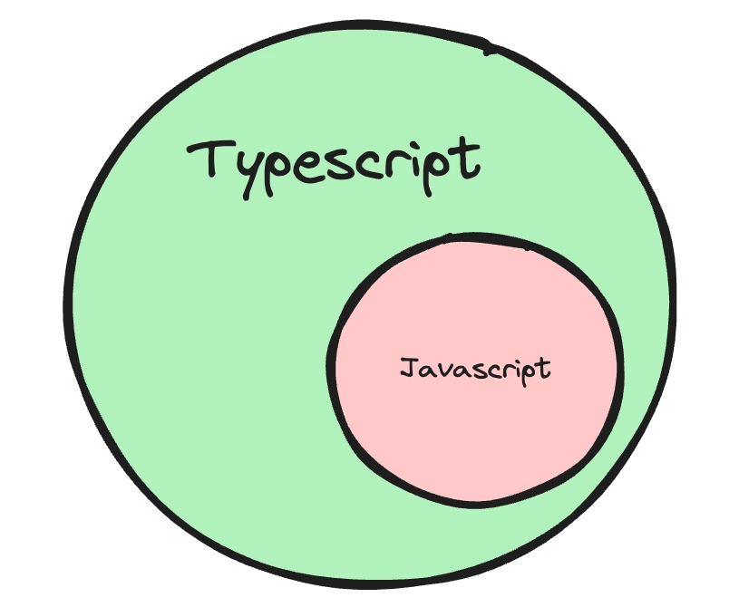

URL - https://projects.100xdevs.com/tracks/6SbPPXGkG8QKFOTW9BmL/ts-1
# Types of languages

## 1. Strongly typed vs loosely typed

The terms `strongly typed` and `loosely typed` refer to how programming languages handle types, particularly how strict they are about type conversions and type safety.

### Strongly typed languages

1. Examples - Java, C++, C, Rust
2. Benefits -
    1. Lesser runtime errors
    2. Stricter codebase
    3. Easy to catch errors at compile time

### Code doesn’t work

```jsx
#include <iostream>

int main() {
  int number = 10;
  number = "text";
  return 0;
}
```

### Loosely typed languages

1. Examples - Python, Javascript, Perl, php
2. Benefits
    1. Easy to write code
    2. Fast to bootstrap
    3. Low learning curve

### Code does work

```jsx

function main() {
  let number = 10;
  number = "text";
  return number;
}
```


People realised that javascript is a very powerful language, but lacks types. `Typescript` was introduced as a new language to add `types` on top of javascript.
---
# What is Typescript

### What is typescript?

TypeScript is a programming language developed and maintained by Microsoft.

It is a strict `syntactical superset` of JavaScript and adds optional static typing to the language.



### Where/How does typescript code run?

Typescript code never runs in your browser. Your browser can only understand `javascript`.

1. Javascript is the runtime language (the thing that actually runs in your browser/nodejs runtime)
2. Typescript is something that compiles down to javascript
3. When typescript is compiled down to javascript, you get `type checking` (similar to C++). If there is an error, the conversion to Javascript fails.


### Typescript compiler

`tsc` is the official typescript compiler that you can use to convert `Typescript` code into `Javascript`

There are many other famous compilers/transpilers for converting Typescript to Javascript. Some famous ones are -

1. esbuild
2. swc
---
# **The tsc compiler**

Let’s bootstrap a simple Typescript Node.js application locally on our machines

### **Step 1 - Install tsc/typescript globally**

```jsx
npm install -g typescript
```

### **Step 2 - Initialize an empty Node.js project with typescript**

```jsx
mkdir node-app
cd node-app
npm init -y
npx tsc --init
```

These commands should initialize two files in your project


### **Step 3 - Create a a.ts file**

```jsx
const x: number = 1;
console.log(x);
```

### **Step 4 - Compile the ts file to js file**

```jsx
tsc -b
```

### **Step 5 - Explore the newly generated index.js file**


Notice how there is no typescript code in the javascript file. It’s a plain old js file with no `types`

### **Step 7 - Delete `a.js`**

### **Step 6 - Try assigning x to a string**

Make sure you convert the `const` to `let`

```jsx
let x: number = 1;
x = "harkirat"
console.log(x);
```

### **Step 7 - Try compiling the code again**

```jsx
tsc -b
```

Notice all the errors you see in the console. This tells you there are `type` errors in your codebase.

Also notice that no `index.js` is created anymore


This is the high level benefit of typescript. It lets you catch `type` errors at `compile time`
---
# **Basic Types in TypeScript**

## **Typescript provides you some basic types**

`number`, `string`, `boolean`, `null`, `undefined`.
Let’s create some simple applications using these types - 

## **Problem 1 - Hello world**

```
💡 Thing to learn - How to give types to arguments of a function
```

Write a function that greets a user given their first name.
Argument - firstName
Logs - Hello {firstName}
Doesn’t return anything

- Solution
    
    ```tsx
    function greet(firstName: string) {
        console.log("Hello " + firstName);
    }
    
    greet("harkirat");
    ```
    

## **Problem 2 - Sum function**

```
💡Thing to learn - How to assign a return type to a function
```

Write a function that calculates the sum of two functions

- Solution
    
    ```tsx
    function sum(a: number, b: number): number {
        return a + b;
    }
    
    console.log(sum(2, 3));
    ```
    

## **Problem 3 - Return true or false based on if a user is 18+**

```
💡Thing to learn - Type inference
```

Function name - isLegal

- Solution
    
    ```tsx
    function isLegal(age: number) {
        if (age > 18) {
            return true;
        } else {
            return false
        }
    }
    
    console.log(isLegal(2));
    ```
    


## Problem 4 - Create a function that takes another function as input, and runs if after 1 second.

- Solution
    
    ```tsx
    function delayedCall(fn: () => void) {
        setTimeout(fn, 1000);
    }
    
    delayedCall(function() {
        console.log("hi there");
    })
    ```
---
# **The tsconfig file**

The `tsconfig` file has a bunch of options that you can change to change the compilation process.

Some of these include

## **1. target**

The `target` option in a `tsconfig.json` file specifies the ECMAScript target version to which the TypeScript compiler will compile the TypeScript code.

To try it out, try compiling the following code for target being `ES5` and `es2020`

```jsx
const greet = (name: string) => `Hello, ${name}!`;
```

- Output for ES5
    
    ```jsx
    "use strict";
    var greet = function (name) { return "Hello, ".concat(name, "!"); };
    ```
    
- Output for ES2020
    
    ```jsx
    "use strict";
    const greet = (name) => `Hello, ${name}!`;
    ```
    

## **2. rootDir**

Where should the compiler look for `.ts` files. Good practise is for this to be the `src` folder

## **3. outDir**

Where should the compiler look for spit out the `.js` files.

## **4. noImplicitAny**

Try enabling it and see the compilation errors on the following code -

```jsx
const greet = (name) => `Hello, ${name}!`;
```

Then try disabling it

## **5. removeComments**

Weather or not to include comments in the final `js` file
---
# **Interfaces**

## **1. What are interfaces**

How can you assign types to objects? For example, a user object that looks like this -

```jsx
const user = {
	firstName: "harkirat",
	lastName: "singh",
	email: "email@gmail.com".
	age: 21,
}
```

To assign a type to the `user` object, you can use `interfaces`

```jsx
interface User {
	firstName: string;
	lastName: string;
	email: string;
	age: number;
}
```

Assignment #1 - Create a function `isLegal` that returns true or false if a user is above 18. It takes a user as an input.

- Solution
    
    ```jsx
    interface User {
    	firstName: string;
    	lastName: string;
    	email: string;
    	age: number;
    }
    
    function isLegal(user: User) {
        if (user.age > 18) {
            return true
        } else {
            return false;
        }
    }
    ```
    

Assignment #2 - Create a React component that takes todos as an input and renders them
```
💡 Select typescript when initialising the react project using `npm create vite@latest`
```
- Solution
    
    ```jsx
    // Todo.tsx
    interface TodoType {
      title: string;
      description: string;
      done: boolean;
    }
    
    interface TodoInput {
      todo: TodoType;
    }
    
    function Todo({ todo }: TodoInput) {
      return <div>
        <h1>{todo.title}</h1>
        <h2>{todo.description}</h2>
    
      </div>
    }
    ```
    
## **2. Implementing interfaces**

Interfaces have another special property. You can `implement` interfaces as a class.

Let’s say you have an person`interface` -

```jsx
interface Person {
    name: string;
    age: number;
    greet(phrase: string): void;
}
```

You can create a class which `implements` this interface.

```jsx
class Employee implements Person {
    name: string;
    age: number;

    constructor(n: string, a: number) {
        this.name = n;
        this.age = a;
    }

    greet(phrase: string) {
        console.log(`${phrase} ${this.name}`);
    }
}
```

This is useful since now you can create multiple `variants` of a person (Manager, CEO …)


## **Summary**

1. You can use `interfaces` to aggregate data
2. You can use interfaces to implement classes from
```
💡 Abstract classes let you do something similar (not TS related)
```
```jsx
abstract class Shape {
  abstract name: string;

  abstract calculateArea(): number;

  describe(): void {
    console.log(`This shape is a ${this.name} with an area of ${this.calculateArea()} units squared.`);
  }
}
```

Rectangle and Circle classes
```jsx
class Rectangle extends Shape {
  name = "Rectangle";

  constructor(public width: number, public height: number) {
    super();
  }

  // Implement the abstract method
  calculateArea(): number {
    return this.width * this.height;
  }
}

// Another subclass implementing the abstract class
class Circle extends Shape {
  name = "Circle";

  constructor(public radius: number) {
    super();
  }

  // Implement the abstract method
  calculateArea(): number {
    return Math.PI * this.radius * this.radius;
  }
}
```

---
# **Types**

## **What are types?**

Very similar to `interfaces` , types let you `aggregate` data together.

```jsx
type User = {
	firstName: string;
	lastName: string;
	age: number
}
```

But they let you do a few other things.

### **1. Unions**

- Let’s say you want to print the `id` of a user, which can be a number or a string.
- A union type means a value can be one of several types.
```
💡 You can not do this using `interfaces`
```
```jsx
type ID = string | number;

let userId: ID;
userId = "abc123"; // valid
userId = 123;      // valid
userId = true;     // Error: 'boolean' is not assignable to type 'ID'
```
```jsx
type StringOrNumber = string | number;

function printId(id: StringOrNumber) {
  console.log(`ID: ${id}`);
}

printId(101); // ID: 101
printId("202"); // ID: 202
```
- Union with objects
```jsx
type Cat = { kind: "cat"; meow: () => void };
type Dog = { kind: "dog"; bark: () => void };

function handlePet(pet: Cat | Dog) {
  // pet.meow(); // Error - TS doesn't know if it's a Cat or Dog yet

  // Narrow the type first using a type guard
  if (pet.kind === "cat") {
    pet.meow(); // OK, narrowed to Cat
  } else {
    pet.bark(); // OK, narrowed to Dog
  }
}
```

### **2. Intersection**

What if you want to create a type that has every property of multiple `types`/ `interfaces`
```
💡 You can not do this using `interfaces`
```
```jsx
type Employee = {
  name: string;
  startDate: Date;
};

type Manager = {
  name: string;
  department: string;
};

type TeamLead = Employee & Manager;

const teamLead: TeamLead = {
  name: "harkirat",
  startDate: new Date(),
  department: "Software developer"
};
```
---
# **Arrays in TS**
If you want to access arrays in typescript, it’s as simple as adding a `[]` annotation next to the type

## **Example 1**
Given an array of positive integers as input, return the maximum value in the array

- Solution
    
    ```tsx
    function maxValue(arr: number[]) {
        let max = 0;
        for (let i = 0; i < arr.length; i++) {
            if (arr[i] > max) {
                max = arr[i]
            }
        }
        return max;
    }
    
    console.log(maxValue([1, 2, 3]));
    ```
## **Example 2**

Given a list of users, filter out the users that are legal (greater than 18 years of age)

```tsx
interface User {
	firstName: string;
	lastName: string;
	age: number;
}
```
- Solution
    
    ```tsx
    interface User {
    	firstName: string;
    	lastName: string;
    	age: number;
    }
    
    function filteredUsers(users: User[]) {
        return users.filter(x => x.age >= 18);
    }
    
    console.log(filteredUsers([{
        firstName: "harkirat",
        lastName: "Singh",
        age: 21
    }, {
        firstName: "Raman",
        lastName: "Singh",
        age: 16
    }, ]));
    ```
---
# **Enums**

Enums (short for enumerations) in TypeScript are a feature that allows you to define a set of named constants.

The concept behind an enumeration is to create a human-readable way to represent a set of constant values, which might otherwise be represented as numbers or strings.

## **Example 1 - Game**

Let’s say you have a game where you have to perform an action based on weather the user has pressed the `up` arrow key, `down` arrow key, `left` arrow key or `right` arrow key.

```jsx
function doSomething(keyPressed) {
	// do something.
}
```

What should the `type` of keyPressed be?

Should it be a string? (`UP` , `DOWN` , `LEFT`, `RIGHT`) ?

Should it be numbers? (`1`, `2`, `3`, `4`) ?

The best thing to use in such a case is an `enum`.

```jsx
enum Direction {
    Up,
    Down,
    Left,
    Right
}

function doSomething(keyPressed: Direction) {
	// do something.
}

doSomething(Direction.Up)
```

This makes code slightly `cleaner` to read out.
```
💡 The final value stored at `runtime` is still a number (0, 1, 2, 3).
```

## **2. What values do you see at runtime for `Direction.UP` ?**

Try logging `Direction.Up` on screen

- Code
    
    ```jsx
    enum Direction {
        Up,
        Down,
        Left,
        Right
    }
    
    function doSomething(keyPressed: Direction) {
    	// do something.
    }
    
    doSomething(Direction.Up)
    console.log(Direction.Up)
    ```
    


This tells you that by default, `enums` get values as `0` , `1`, `2`...

## **3. How to change values?**

```jsx
enum Direction {
    Up = 1,
    Down, // becomes 2 by default
    Left, // becomes 3
    Right // becomes 4
}

function doSomething(keyPressed: Direction) {
	// do something.
}

doSomething(Direction.Down)
```

## **4. Can also be strings**

```jsx
enum Direction {
    Up = "UP",
    Down = "Down",
    Left = "Left",
    Right = 'Right'
}

function doSomething(keyPressed: Direction) {
	// do something.
}

doSomething(Direction.Down)
```

## **5. Common usecase in express**

```jsx
enum ResponseStatus {
    Success = 200,
    NotFound = 404,
    Error = 500
}

app.get("/', (req, res) => {
    if (!req.query.userId) {
			res.status(ResponseStatus.Error).json({})
    }
    // and so on...
		res.status(ResponseStatus.Success).json({});
})
```
---