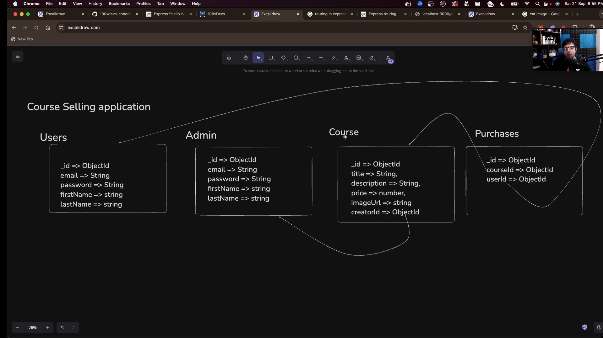

## Create a course selling app
- Initialize a new Node.js project
- Add Express, jsonwebtoken, mongoose to it as a dependency
- Create index.js
- Add route skeleton for user login, signup, purchase a course, sees all course, see the purchased course
- Add routes for admin login, admin signup, create a course, delete a course, add course content.
- Add middlewares for user and admin auth
- Add a database (mongodb), use dotenv to store the database connection string
- Define the schema for User, Admin, Course, Purchase
- Complete the routes for user login, signup, purchase a course, see course (Extra points - Use express routing to better structure your routes)
- Create the frontend

# Good to haves

Use cookies instead of JWT for auth
Add a rate limiting middleware
Frontend in ejs (low pri)
Frontend in React

# Routing in Express

- Routing in [**Express.js**](https://expressjs.com/en/guide/routing.html) is **the process of determining how an application responds to a client request for a specific endpoint (a URI path) and HTTP method (GET, POST, PUT, DELETE, etc.)**.
- One way to do routing is to put different routes in routes folders and export them from there
- and then import all the routes in index.js
- User Routes -

```jsx
function createUserRoutes(app) {
	app.post('/user/signup', async function (req, res) {

	});

	app.post('/user/signin', async function (req, res) {

	});

	app.get('/user/purchases', async function (req, res) {
    
	});
}

module.export({
	createUserRoutes: createUserRoutes,
	});
```

- Course Routes -

```jsx
function createCourseRoutes (app) {
	app.post('/course/purchase', async function (req, res) {
    
	});

	app.get('/courses', async function (req, res) {
    
	});
}

module.export({
	createCourseRoutes: createCourseRoutes 
})
```

- Importing these routes in index.js
``` jsx
	const { createUserRoutes } = require("./routes/user");
	const { createCourseRoutes } = require("./routes/course");
	
	createUserRoutes(app);
	createCourseRoutes(app);
``` 

- But a better approach is to use Routers like this
- User.js file -

```jsx
const express = require('express');
const Router = express.Router;
// or
const { Router } = require('express');
const userRouter = Router();

userRouter.post('/signup', async function (req, res) {

});

userRouter.post('/signin', async function (req, res) {

});

userRouter.get('/purchases', async function (req, res) {
    
});

module.exports = {
    userRouter: userRouter,
}
```

- Course.js file

```jsx
import { Router } from "express";
const courseRouter = Router();

courseRouter.post('/purchase', async function (req, res) {
    
});

courseRouter.get('/course', async function (req, res) {
    
});

module.exports = ({
    courseRouter: courseRouter,
})
```

- and to get this in index.js

```jsx
import express from 'express';
import { userRouter } from './routes/user';
import { courseRouter } from './routes/course'

const app = express();

app.use('/user', userRouter);
app.use('/course', courseRouter);

app.listen(PORT, () => {
    console.log(`Server is running`);
	});
```

# Benefits of using routers

## Clean & Scalable Project Structure

Instead of putting everything in `index.js`:

Bad way:

```jsx
app.post('/user/signup', ...)
app.post('/user/login', ...)
app.get('/course/all', ...)
app.post('/course/buy', ...)
```

Your file becomes 1000+ lines in real projects.

Better way:

- `routes/user.js`
- `routes/course.js`
- `index.js` only mounts them

This keeps your project organized, this is **industry standard structure**.

## Automatic Route Prefixing

When you do:

```jsx
app.use('/user',userRouter);
```

Every route inside `userRouter` automatically gets `/user` added.

Example:

Inside `userRouter`:

```jsx
router.post('/signup', ...)
```

Actual endpoint becomes:

```jsx
POST /user/signup
```

You don’t have to repeat `/user` everywhere.

This reduces duplication and errors.

- Making the schema Database
;