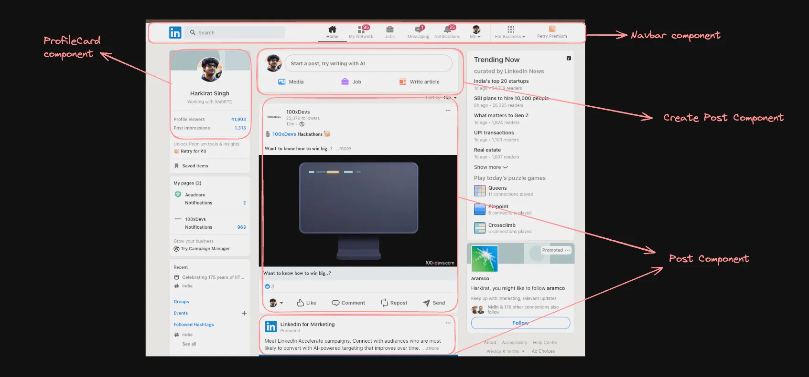
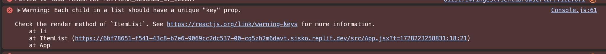

[https://petal-estimate-4e9.notion.site/React-Part-1-1177dfd1073580069172fc54e33929c0](https://www.notion.so/1177dfd1073580069172fc54e33929c0?pvs=21)
    
Lecture slides - https://www.canva.com/design/DAGStTo7_1Y/H-uoNlkdJ2X4P3LbOME45Q/edit

# React

- **React** is a **JavaScript library** used to build **user interfaces (UI),** especially for web applications.
- It was created by **Facebook** (now **Meta Platforms**) and is widely used for building modern websites and web apps.
- React is just easier way to write normal HTML/CSS/JS, It’s a new syntax, that user the hood gets converted to HTML/CSS/JS only.

---

# But why React?

- People realised it’s harder to do DOM manipulation the conventional way
- There were libraries that came into the picture that made it slightly easy, but still for a very big app it’s very hard (jQuery)
- Eventually, Vue.js/ React created a new syntax to do frontend
- Under the hood, the react compiler convert your code to HTML/CSS/JS

---

# Starting a react project locally

There are various ways to bootstrap a react project locally. Vite is the most widely used one today. 

## Vite

Ref - https://vite.dev/guide/

Vite (French word for "quick", pronounced `/vit/`, like "veet") is a build tool that aims to provide a faster and leaner development experience for modern web projects. It consists of two major parts:

- A dev server that provides [**rich feature enhancements**](https://vite.dev/guide/features) over [**native ES modules**](https://developer.mozilla.org/en-US/docs/Web/JavaScript/Guide/Modules), for example extremely fast [**Hot Module Replacement (HMR)**](https://vite.dev/guide/features#hot-module-replacement).
- A build command that bundles your code with [**Rollup**](https://rollupjs.org/), pre-configured to output highly optimized static assets for production.

---

### Initializing a react project

```bash
npm create vite@latest
```

---

# Components

In React, components are the building blocks of the user interface. They allow you to split the UI into independent, re-usable pieces that can be thought of as custom, self-contained HTML elements.


---

# useState

`useState` is a Hook that lets you add state to functional components. It returns an array with the current state and a function to update it.

```jsx
import React, { useState } from 'react';

const Counter = () => {
    const [count, setCount] = useState(0);

    return (
        <div>
            <p>Count: {count}</p>
            <button onClick={() => setCount(count + 1)}>Increment</button>
        </div>
    );
};
```
---

# Notification count code

```jsx
import { useState } from "react";

function App() {
  return (
    <div style={{background: "#dfe6e9", height: "100vh" }}>
      <ToggleMessage />
      <ToggleMessage />
      <ToggleMessage />
    </div>
  )
}

// the component isnt re-rendering
// because we havent used a state variable

const ToggleMessage = () => {
  let [notificationCount, setNotificationCount] = useState(0);

  console.log("re-render");
  function increment() {
    setNotificationCount(notificationCount + 1);
  }

  return (
      <div>
          <button onClick={increment}>
              Increase count
          </button>
          {notificationCount}
      </div>
  );
};

```
--- 

# Post component

```jsx

const style = { width: 200, backgroundColor: "white", borderRadius: 10, borderColor: "gray", borderWidth: 1, padding: 20 }

export function PostComponent({name, subtitle, time, image, description}) {
  return <div style={style}> 
    <div style={{display: "flex"}}>
      
      <div style={{fontSize: 10, marginLeft: 10}}>
        <b>
          {name}
        </b>
        <div>{subtitle}</div>
        {(time !== undefined) ? <div style={{display: 'flex'}}>
          <div>{time}</div>      
          
        </div> : null}
      </div>
    </div>
    <div style={{fontSize: 12}}>
     {description}
    </div>
 </div>
}
```

- Solution
    
    ```jsx
    import { useState } from "react";
    import { PostComponent } from "./Post";
    
    function App() {
      const [posts, setPosts] = useState([]);
    
      const postComponents = posts.map(post => <PostComponent
        name={post.name}
        subtitle={post.subtitle}
        time={post.title}
        image={post.image}
        description={post.description}
      />)
    
      function addPost() {
        setPosts([...posts, {
          name: "harkirat",
          subtitle: "10000 followers",
          time: "2m ago",
          image: "https://appx-wsb-gcp-mcdn.akamai.net.in/subject/2023-01-17-0.17044360120951185.jpg",
          description: "What to know how to win big? Check out how these folks won $6000 in bounties."
        }])
      }
    
      return (
        <div style={{background: "#dfe6e9", height: "100vh", }}>
          <button onClick={addPost}>Add post</button>
          <div style={{display: "flex", justifyContent: "center" }}>
            <div>
              {postComponents}
            </div>
          </div>
        </div>
      )
    }
    
    export default App
    
    ```
    
---

# Tracking re-renders

Install the react dev tools to track which components are re-rendering as your state changes

https://chromewebstore.google.com/detail/react-developer-tools/fmkadmapgofadopljbjfkapdkoienihi?pli=1

- Creating a button just by using own component/state/Re-Rendering code

    ```jsx
        let state = {
        	count: 0;
        }
        
        function onButtonPress() {
        	state.count = state.count + 1;
        	buttonComponentReRender();	
        }
        
        function buttonComponentReRender() {
        	document.getElementById("buttonParent").innerHTML = "";
        	const componet = buttonComponent(state.count);
        	document.getElementById("buttonParent").appendChild(component);
        }
        
        function buttonComponent(count) {
        	const button = document.createElement("button");
        	button.innerHTML = "Counter " + count;
        	button.setAttribute("onclick", `onButtonPress()`);
        	return button;
        }
        
        // this is how the function converts in HTML
        // <button onclick = "onButtonPress">Counter 0</button>
    ```
---

# JSX (JavaScript XML)

- It is a syntax extension for JS, most commonly used with React, a popular JS library for building UI.
- JSX allows you to write HTML-like code directly withing JS.
- This makes it easier to create and manage the user interface in React applications.
- Making button component using react

```jsx
import { useState } from 'react';
import './App.css';

export default function App() {
	const [count, setCount] = useState(0); // [1, 2]
	
	function onClickHandler() {
		setCouse(count + 1);
	}
	
	return (
	<div>
		<Button onClickHandler={onClickHandlet}></Button>
	</div>
	);
}

function Button(props) {
	return <button onClick={props.onClickHandler}>Counter {count}</button>;
```

# Making a Todo application in React

```jsx
import { useState } from 'react';
import '/App.css';

export default fucntion App() {
	const [todos, setTodos] = useState([
		title: "Go to Gym",
		description: "Hit the gym regularly",
		done: false
	]);
	
function addTodo() {
	let newArray = [];
	for (let i = 0 ; i < todos.length ; i++) {
		newArray.push(todos[i]0);
}
newArray.push({
	title: document.getElementById('title').value,
	description: document.getElementById('description').value,
	done: true,
});
setTodos(newArray);
}
	
return <div> 
	<input id="title" type="text" placeholder="Title"></input>
	<input id="description" type="text" placeholder="Description"></input>
	<br/>
	<button onClick={addTodo}>Add todo</button>
	<br/>
	{JSON.stringify(todos)};
	</div>;
}
		
```

# React Fiber, Virtual DOM and Reconciliation

1. The createRoot create's its own DOM and then compare it with the web browser's DOM and only update those components which are actually updated.
2. But the browser removes the whole DOM and then recrates the whole DOM with the updated values this is called reload.
3. However virtual DOM tracks whole DOM like a tree like structure and updates only those values which were only changed.
4. But some values depends on network call so if we update a value it might get update immediately via a network call.
5. So we will have to update it again. To avoid this overhead we can drop the updation calls for the immediate value update.
6. The current algo used by the React is called the React Fiber algo.
7. The algo react uses to differentiate the web browser's tree and React's tree formed through create root is called reconciliation.
8. Reconciliation is the algo behind what popularly known as the Virtual-DOM.
9. In UI it is not necessary for every update to be applied immediately

---
# Lifecycle Events of React

## 1. Mounting (Birth of the Component)

This is when your component is **created and added to the DOM**.

### What happens:

- Component function runs
- JSX gets rendered on screen
- State is initialized

### Example:

```jsx
useEffect(() => {
  console.log("Component mounted");
}, []);
```

- The empty dependency array [ ] means : runs only once when the component loads

## 2. Re-rendering / Updating

This happens when something changes and React needs to **update the UI**.

### Triggers:

- State change (`setState`)
- Props change
- Parent component re-renders

### Example:

```jsx
useEffect(() => {
  console.log("Component updated");
});
```

- No dependency array means: Runs after **every render**

Or more controlled:

```jsx
useEffect(() => {
  console.log("Count changed");
}, [count]);
```

- Runs only when `count` changes

## 3. Unmounting (Death of Component)

This is when the component is **removed from the DOM**.

### Use case:

- Clean up things like:
    - `setInterval`
    - Event listeners
    - API subscriptions

### Example:

```jsx
useEffect(() => {
console.log("Mounted");

return () => {
console.log("Component unmounted");
  };
}, []);
```

- The `return` function = cleanup function, Runs when component is remove

# useEffect Hook

Before we understand `useEffect` , let’s understand what are `Side effects`.

## Side effects

Side effects are operations that interact with the outside world or have effects beyond the component's rendering. Examples include:

- **Fetching data** from an API.
- **Modifying the DOM** manually.
- **Subscribing to events** (like WebSocket connections, timers, or browser events).
- **Starting a clock**

These are called side effects because they don't just compute output based on the input—they affect things outside the component itself.

---

### Problem in running side effects in React components

If you try to introduce side effects directly in the rendering logic of a component (in the return statement or before it), React would run that code every time the component renders. This can lead to:

- **Unnecessary or duplicated effects** (like multiple API calls).
- **Inconsistent behavior** (side effects might happen before rendering finishes).
- **Performance issues** (side effects could block rendering or cause excessive re-rendering).

---

## **How `useEffect` Manages Side Effects:**

The `useEffect` hook lets you perform side effects in functional components in a safe, predictable way:

```jsx
useEffect(() => {
  // Code here is the "effect" — this is where side effects happen
  fetchData();

  // Optionally, return a cleanup function that runs when the component unmounts.
  return () => {
    // Cleanup code, e.g., unsubscribing from an event or clearing timers.
  };
}, [/* dependencies */]);
```

- **The first argument** to `useEffect` is the effect function, where you put the code that performs the side effect.
- **The second argument** is the dependencies array, which controls when the effect runs. This array tells React to re-run the effect only when certain values (props or state) change. If you pass an empty array `[]`, the effect will only run **once** after the initial render.
- **Optional Cleanup**: If your side effect needs cleanup (e.g., unsubscribing from a WebSocket, clearing intervals), `useEffect` allows you to return a function that React will call when the component unmounts or before re-running the effect.

---

## To recap

`useEffect` is a Hook that lets you perform side effects in functional components. It can be used for data fetching, subscriptions, or manually changing the DOM.


---
## Linkedin like topbar

```jsx
import { useEffect, useState } from "react";

function App() {
  const [currentTab, setCurrentTab] = useState(1);
  const [tabData, setTabData] = useState({});
  const [loading, setLoading] = useState(true);

  useEffect(function() {
    setLoading(true);
    fetch("https://jsonplaceholder.typicode.com/todos/" + currentTab)
      .then(async res => {
        const json = await res.json();
        setTabData(json);
        setLoading(false);
      });

  }, [])
  
  return <div>
    <button onClick={function() {
      setCurrentTab(1)
    }} style={{color: currentTab == 1 ? "red" : "black"}}>Todo #1</button>
    <button onClick={function() {
      setCurrentTab(2)
    }} style={{color: currentTab == 2 ? "red" : "black"}}>Todo #2</button>
    <button onClick={function() {
      setCurrentTab(3)
    }} style={{color: currentTab == 3 ? "red" : "black"}}>Todo #3</button>
    <button onClick={function() {
      setCurrentTab(4)
    }} style={{color: currentTab == 4 ? "red" : "black"}}>Todo #4</button>
<br /> 
    {loading ? "Loading..." : tabData.title}
  </div>
}

export default App

```


## Create a Countdown

```jsx 
import React, { useState, useEffect } from 'react';

const Timer = () => {
    const [seconds, setSeconds] = useState(0);

    useEffect(() => {
        const interval = setInterval(() => {
            setSeconds(prev => prev + 1);
        }, 1000);

        return () => clearInterval(interval); // Cleanup on unmount
    }, []);

    return <div>{seconds} seconds elapsed</div>;
};

```

## Fetching data

```jsx 
import React, { useState, useEffect } from 'react';

const UserList = () => {
    const [users, setUsers] = useState([]);
    const [loading, setLoading] = useState(true);

    useEffect(() => {
        const fetchData = async () => {
            try {
                const response = await fetch('https://jsonplaceholder.typicode.com/users');
                const data = await response.json();
                setUsers(data);
            } catch (error) {
                console.error('Error fetching data:', error);
            } finally {
                setLoading(false);
            }
        };

        fetchData();
    }, []); // Empty dependency array means this runs once when the component mounts.

    if (loading) {
        return <div>Loading...</div>;
    }

    return (
        <ul>
            {users.map(user => (
                <li key={user.id}>{user.name}</li>
            ))}
        </ul>
    );
};

export default UserList;

```
# Conditional Rendering

- Showing different UI based on a condition
- You can render different components or elements based on certain conditions.
- Just like in JavaScript you use `if`, `else`, or `ternary`, React lets you decide **what to render on the screen depending on state, props, or any condition**.

```jsx
import React, { useState } from 'react';

const ToggleMessage = () => {
    const [isVisible, setIsVisible] = useState(false);

    return (
        <div>
            <button onClick={() => setIsVisible(!isVisible)}>
                Toggle Message
            </button>
            {isVisible && <p>This message is conditionally rendered!</p>}
        </div>
    );
};

```
# Props
- Props are the way to pass data from one component to another in React.

```jsx
import React from 'react';

const Greeting = ({ name }) => {
    return <h1>Hello, {name}!</h1>;
};

const App = () => {
    return <Greeting name="Alice" />;
};

```

# Children

The `children` prop allows you to pass elements or components as props to other components.


## Card component

```jsx
import React from 'react';

const Card = ({ children }) => {
    return (
        <div style={{
            border: '1px solid #ccc',
            borderRadius: '5px',
            padding: '20px',
            margin: '10px',
            boxShadow: '2px 2px 5px rgba(0, 0, 0, 0.1)',
        }}>
            {children}
        </div>
    );
};

const App = () => {
    return (
        <div>
            <Card>
                <h2>Card Title</h2>
                <p>This is some content inside the card.</p>
            </Card>
            <Card>
                <h2>Another Card</h2>
                <p>This card has different content!</p>
            </Card>
        </div>
    );
};

export default App;
```

## Modals

```jsx
import React, { useState } from 'react';

const Modal = ({ isOpen, onClose, children }) => {
    if (!isOpen) return null;

    return (
        <div style={{
            position: 'fixed',
            top: 0,
            left: 0,
            right: 0,
            bottom: 0,
            backgroundColor: 'rgba(0, 0, 0, 0.5)',
            display: 'flex',
            justifyContent: 'center',
            alignItems: 'center',
        }}>
            <div style={{
                background: 'white',
                padding: '20px',
                borderRadius: '5px',
            }}>
                <button onClick={onClose}>Close</button>
                {children}
            </div>
        </div>
    );
};

const App = () => {
    const [isModalOpen, setModalOpen] = useState(false);

    return (
        <div>
            <button onClick={() => setModalOpen(true)}>Open Modal</button>
            <Modal isOpen={isModalOpen} onClose={() => setModalOpen(false)}>
                <h2>Modal Title</h2>
                <p>This is some content inside the modal.</p>
            </Modal>
        </div>
    );
};

export default App;
```

## Collapsible Section

```jsx
import React, { useState } from 'react';

const Collapsible = ({ title, children }) => {
    const [isOpen, setIsOpen] = useState(false);

    return (
        <div>
            <button onClick={() => setIsOpen(!isOpen)}>
                {title} {isOpen ? '-' : '+'}
            </button>
            {isOpen && <div>{children}</div>}
        </div>
    );
};

const App = () => {
    return (
        <div>
            <Collapsible title="Section 1">
                <p>This is the content of section 1.</p>
            </Collapsible>
            <Collapsible title="Section 2">
                <p>This is the content of section 2.</p>
            </Collapsible>
        </div>
    );
};

export default App;

```

# **Lists and Keys**

When rendering lists, each item should have a unique key prop for React to track changes efficiently.

```jsx
import React from 'react';

const ItemList = ({ items }) => {
    return (
        <ul>
            {items.map(item => (
                <li key={item.id}>{item.name}</li>
            ))}
        </ul>
    );
};

const App = () => {
    const items = [
        { id: 1, name: 'Item 1' },
        { id: 2, name: 'Item 2' },
        { id: 3, name: 'Item 3' },
    ];

    return <ItemList items={items} />;
};
```

Try removing the `key` from the list render
